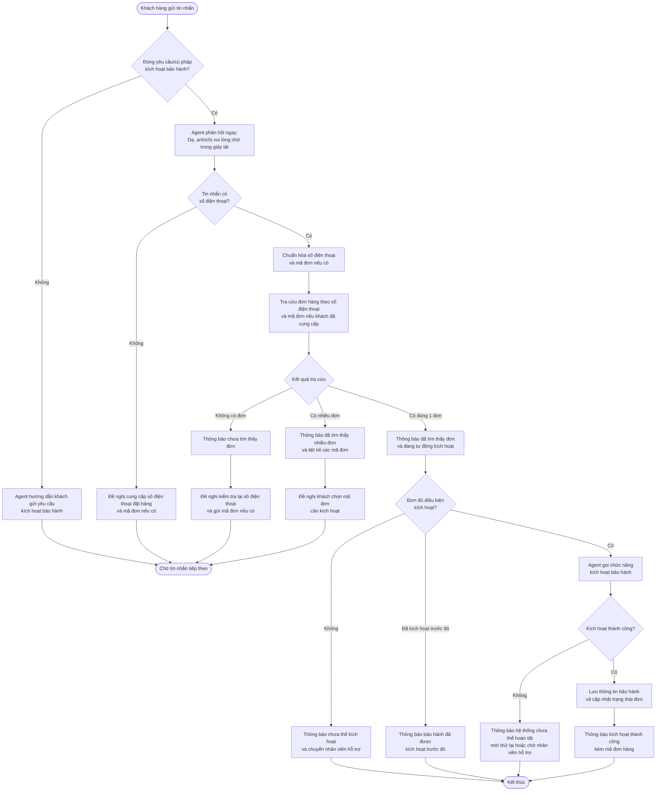
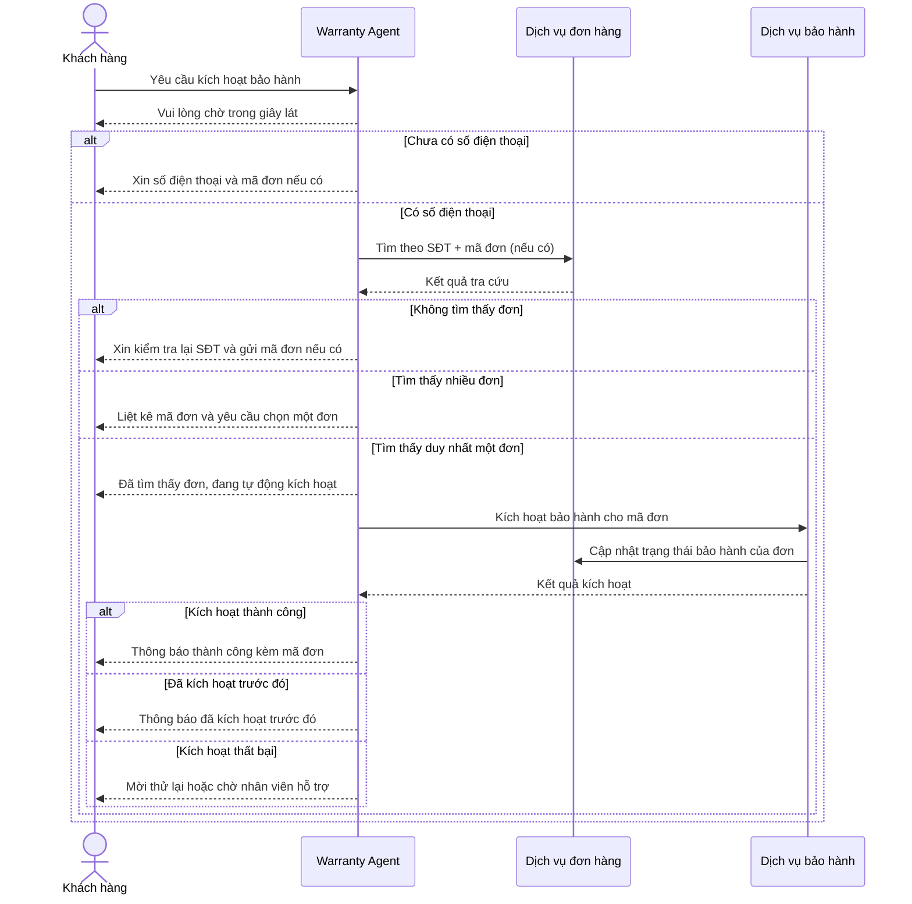

# Flow kích hoạt bảo hành qua tin nhắn

## Flow nghiệp vụ

## Trình tự giữa các thành phần

## Trạng thái hội thoại đề xuất

| Trạng thái | Ý nghĩa |
|---|---|
| `waiting_request` | Chờ đúng yêu cầu kích hoạt bảo hành |
| `waiting_phone` | Chờ khách cung cấp số điện thoại |
| `searching_order` | Đang tra cứu đơn hàng |
| `waiting_order_code` | Có nhiều đơn, chờ khách chọn mã đơn |
| `activating` | Đã xác định duy nhất một đơn và đang kích hoạt |
| `activated` | Kích hoạt thành công |
| `already_activated` | Đơn đã được kích hoạt trước đó |
| `need_human_support` | Không đủ điều kiện hoặc hệ thống gặp lỗi |

## Nguyên tắc bắt buộc

1. Không thông báo tìm thấy đơn trước khi tra cứu thành công.
2. Không kích hoạt khi chưa xác định duy nhất một đơn hàng.
3. Nếu khách đã gửi số điện thoại hoặc mã đơn trong lịch sử hội thoại thì không hỏi lại.
4. Chỉ thông báo thành công sau khi dữ liệu bảo hành đã được lưu và đơn hàng đã được cập nhật.
5. Mỗi mã đơn chỉ được kích hoạt một lần.
6. Phản hồi “chờ trong giây lát” phải được gửi trước khi bắt đầu tác vụ tra cứu dài.
